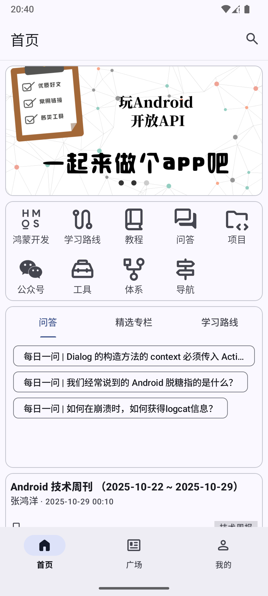
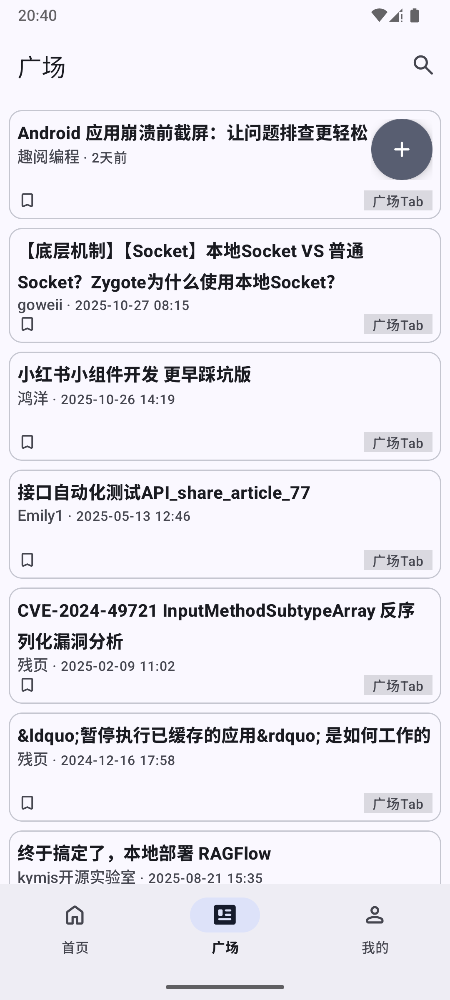
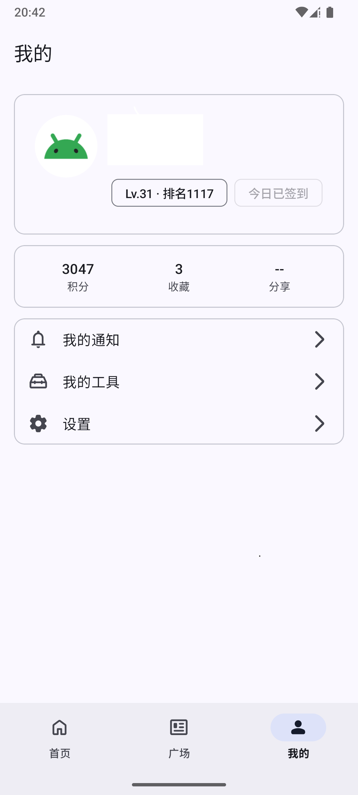

<table>
  <tr>
    <td>
      
    </td>
    <td>
      
    </td>
    <td>
      
    </td>
  </tr>
</table>

## app

- [ ] 首页左侧滑页

## library

- [ ] analytics
- [ ] common
    - Activity耗时优化
        - [x] 异步加载布局
- [x] data
    - Network Api
- [x] domain
    - Network Api Result Model
- [ ] image
- [x] initializer
    - Application耗时优化
        - [x] 任务DAG图检测循环依赖
        - [x] 任务历史耗时调整顺序
- [x] log
    - 封装Timber
- [ ] navigation
- [ ] network
    - [ ] 网络框架设计
- [ ] permission
- [ ] storage
- [ ] theme
- [ ] ui
    - 弹窗管理
        - [ ] 嵌套Fragment传递Host问题
- [ ] webview
    - [x] 预加载
    - [x] 池化
    - [ ] WebViewFragment页面功能
